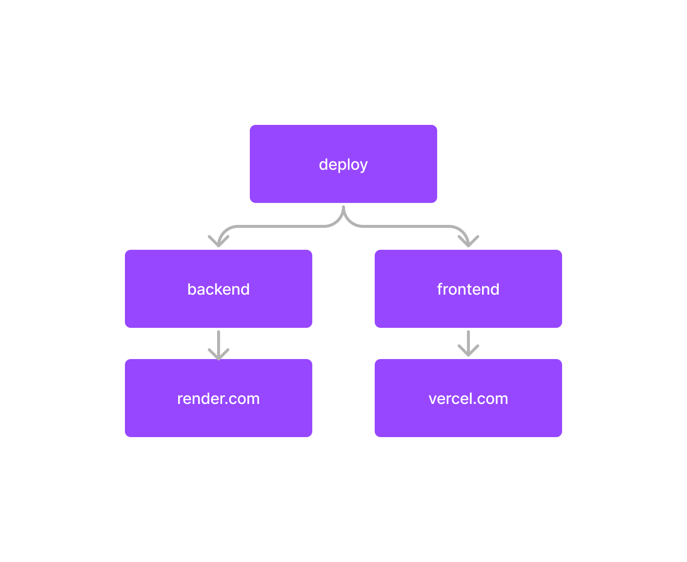

# Chat With Socket.io

## O projeto foi construido com Socket.io, utilizei nodejs para o backend e react para o frontend, o chat possui realTime entre as mensagens de maneira que não precisa reiniciar para vizualizar as mensagens, para facilitar a estilização foi usado Tailwind.css por causa do tempo de entrega.

### Setup para desenvolvedor

## 1 backend

### Criar um .env com base no exemplo e colocar:

```FRONT_URL = "http://localhost:3000"```

### Instalar as dependencias:

```cd backend && npm install```

### Iniciar o projeto

```npm start```

## 2 frontend

### Instalar as dependencias:

```cd frontend && npm install```

### Iniciar o projeto

```npm start```

# Configuração de deploy:

### Para o deploy foi utilizado o render para o backend e a vercel para o react no frontend como mostra a imagem abaixo:

